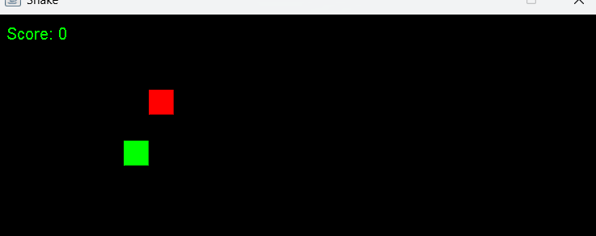
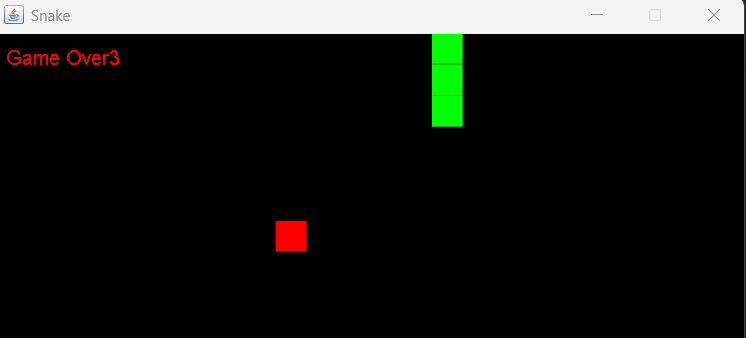

# 🐍 Jeu du Serpent (Snake) - Portfolio


---

## 👋 À propos du projet

Ce projet est une implémentation du célèbre jeu **Snake (Jeu du Serpent)** développée en Java.  

Le joueur contrôle un serpent qui grandit à chaque nourriture consommée.  
Le défi est d’éviter les collisions avec les murs ou avec le propre corps du serpent.

Ce projet met en pratique les concepts fondamentaux de la programmation orientée objet et de la gestion des événements en temps réel.

---

## 🎮 Aperçu du jeu

- 🐍 Déplacement fluide du serpent
- 🍎 Apparition aléatoire de nourriture
- 📈 Score dynamique
- 💀 Détection de collision (mur ou corps)

---

## 📸 Captures d’écran


### 🍎 Début de partie


### 💀 Game Over


---

## 🛠️ Technologies utilisées

- **Langage :** Java  
- **Concepts :**  
  - Programmation orientée objet  
  - Tableaux / Listes  
  - Gestion des événements clavier  
  - Boucle de jeu (Game Loop)  
  - Détection de collision  
- **Outils :** Git, GitHub  

---

## 🚀 Lancer le projet

### 1️⃣ Compiler

```bash
javac SnakeGame.java

